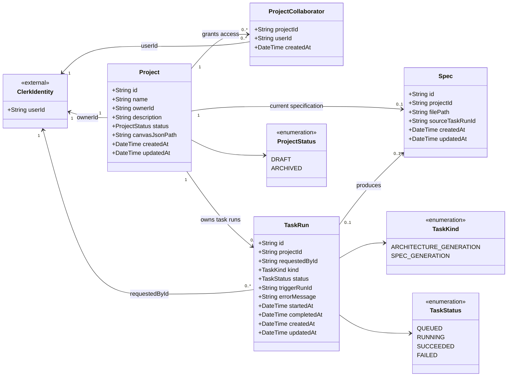
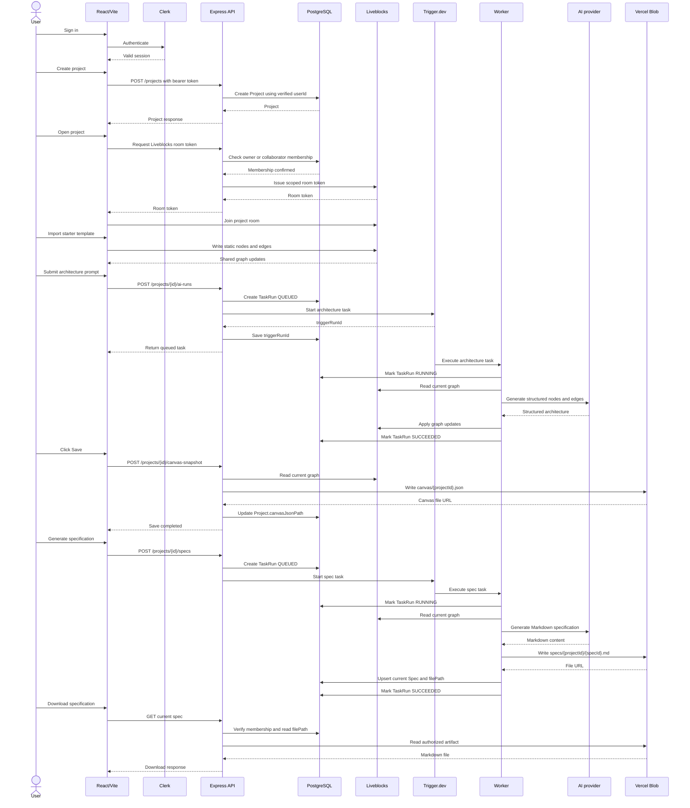

# Ghost AI Architecture Plan

## Purpose

This document records the approved MVP database design, storage boundaries, and Mermaid diagrams for Ghost AI.

The design follows the project context:

- PostgreSQL stores relational metadata and task state.
- Clerk remains the source of truth for user identity.
- Liveblocks owns the active collaborative canvas.
- Vercel Blob stores canvas snapshots and generated Markdown files.
- Trigger.dev runs durable AI workflows outside Express request handlers.

The initial `Project` and `ProjectCollaborator` models are implemented in `packages/database/prisma/schema.prisma`; `Spec` and `TaskRun` remain planned for later feature units.

## Approved MVP Decisions

| Decision | MVP choice | Consequence |
| --- | --- | --- |
| Collaborator access | Direct Clerk user ID | No invitation table or email-token workflow |
| Canvas snapshots | Explicit Save action | The active graph is persisted only when the user saves |
| AI integration | Provider adapter | Worker tasks do not depend directly on one AI vendor |
| Specifications | One current spec per project | Regeneration replaces the current Blob reference; no spec history |

## Storage Boundaries

| Data | System of record | PostgreSQL value |
| --- | --- | --- |
| User identity and sessions | Clerk | External Clerk user IDs only |
| Project metadata | PostgreSQL via Prisma | Full relational record |
| Project collaborators | PostgreSQL via Prisma | Project and Clerk user ID relationship |
| Active graph, presence, and cursors | Liveblocks | No relational graph tables |
| Saved canvas snapshot | Vercel Blob | `Project.canvasJsonPath` |
| AI and spec execution state | PostgreSQL plus Trigger.dev | `TaskRun` metadata and Trigger run ID |
| Generated Markdown | Vercel Blob | `Spec.filePath` |
| Starter templates | Frontend or shared package | No template table |

Blob paths:

```text
canvas/{projectId}.json
specs/{projectId}/{specId}.md
```

## Planned Database Model

### Project

```text
id              String primary key
name            String
ownerId         String              // Clerk user ID
description     String nullable
status          DRAFT | ARCHIVED
canvasJsonPath  String nullable     // Vercel Blob URL
createdAt       DateTime
updatedAt       DateTime
```

The owner is stored directly on the project because every project has exactly one owner. `ownerId` is not a database foreign key because users are managed by Clerk.

### ProjectCollaborator

```text
projectId  String
userId     String                  // Clerk user ID
createdAt  DateTime
```

Constraints:

- Composite primary key: `(projectId, userId)`.
- Index `userId` for the shared-project list.
- The API rejects adding the project owner as a collaborator.
- No invitation, pending state, or collaborator role is modeled in the MVP.

### Spec

```text
id               String primary key
projectId        String unique
filePath         String              // Vercel Blob URL
sourceTaskRunId  String nullable
createdAt        DateTime
updatedAt        DateTime
```

`projectId` is unique so a project has one current specification. `sourceTaskRunId` provides traceability to the successful spec-generation task. Markdown content stays in Vercel Blob.

### TaskRun

```text
id             String primary key
projectId      String
requestedById  String                // Clerk user ID
kind           ARCHITECTURE_GENERATION | SPEC_GENERATION
status         QUEUED | RUNNING | SUCCEEDED | FAILED
triggerRunId   String unique nullable
errorMessage   String nullable
startedAt      DateTime nullable
completedAt    DateTime nullable
createdAt      DateTime
updatedAt      DateTime
```

Recommended indexes:

- `projectId` and `createdAt` for project task history.
- `projectId` and `status` for active task lookup.
- Unique `triggerRunId` for safe worker callbacks and status updates.

The user prompt and task payload are sent through Trigger.dev. The database does not store the current graph or generated output.

## Authorization Invariants

1. The API derives the acting user from the verified Clerk bearer token.
2. A user can access a project only when they are the owner or have a collaborator row.
3. Membership is checked before project mutations, Liveblocks room-token issuance, task creation, and spec downloads.
4. Worker updates verify both `taskRunId` and `triggerRunId`.
5. Blob URLs are generated and stored by server-side integrations, not accepted from browser input.
6. The active graph is never treated as PostgreSQL data while the collaboration session is running.

## Mermaid Flowchart

```mermaid
flowchart TD
    User[Authenticated user]
    Clerk[Clerk authentication]
    Liveblocks[Liveblocks room]
    Blob[Vercel Blob]
    AI[AI provider]

    subgraph Browser
        Web[React Vite frontend]
        Templates[Static starter templates]
    end

    subgraph Backend
        API[Express API]
        DB[(PostgreSQL via Prisma)]
        Trigger[Trigger.dev]
        Worker[Worker tasks]
        Snapshot[Canvas snapshot adapter]
    end

    User --> Web
    Web -->|Authenticate| Clerk
    Clerk -->|Session| Web
    Web -->|Bearer token| API
    API -->|Metadata and authorization| DB

    Templates -->|Import nodes and edges| Web
    Web -->|Real-time edits| Liveblocks
    Liveblocks -->|Graph updates and presence| Web
    API -->|Scoped room token after membership check| Liveblocks

    Web -->|Start AI or spec generation| API
    API -->|Create TaskRun| DB
    API -->|Start durable task| Trigger
    Trigger --> Worker
    Worker -->|Read or update graph| Liveblocks
    Worker -->|Generate structured output| AI
    Worker -->|Update task status| DB
    Worker -->|Write Markdown| Blob
    Worker -->|Save Spec.filePath| DB

    Liveblocks -.->|Explicit Save action| Snapshot
    Snapshot -->|canvas/{projectId}.json| Blob
    Snapshot -->|Save canvasJsonPath| DB

    Web -->|View or download spec| API
    API -->|Read filePath| DB
    API -->|Read authorized artifact| Blob
```

## Mermaid UML Class Diagram



`ClerkIdentity` is a conceptual external identity, not a PostgreSQL table or foreign-key target.

## Mermaid Sequence Diagram



## Implementation Order

1. Extend `Project` and add `ProjectCollaborator` (completed).
2. Implement project creation, listing, ownership, and collaborator authorization.
3. Add Liveblocks room authorization.
4. Add the explicit canvas Save action and Blob snapshot adapter.
5. Add `TaskRun` and the architecture-generation workflow.
6. Add the current `Spec` record and Markdown-generation workflow.
7. Add spec download authorization and failure handling.
8. Run Prisma validation, migrations, API tests, worker tests, and frontend build verification.

Each step should remain a separate feature unit. Real-time canvas behavior and database snapshot persistence should not be implemented as one undifferentiated change.

## Explicit Non-Goals

- Local user synchronization with Clerk.
- Email invitation workflows.
- Template database records.
- PostgreSQL node and edge tables.
- Presence and cursor persistence.
- Versioned specification history.
- Billing, subscription, or enterprise permission models.
